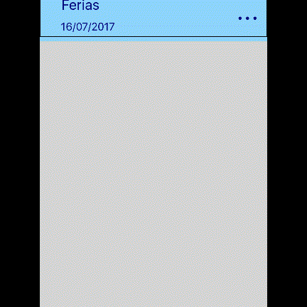
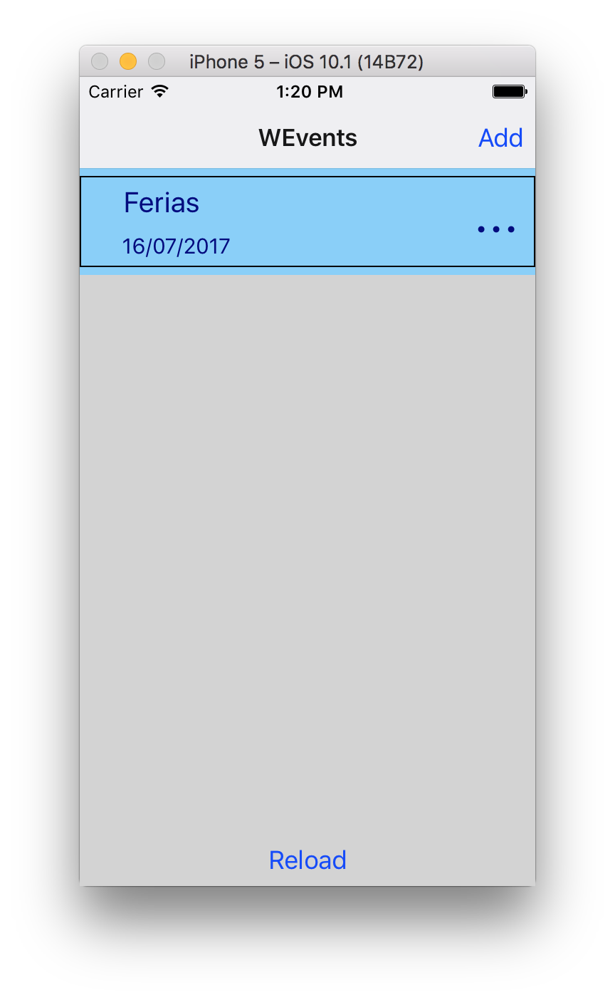
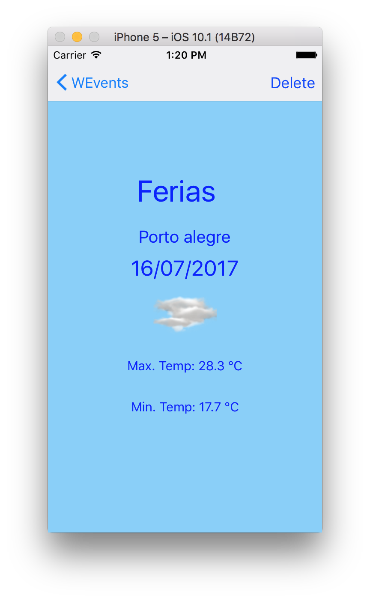
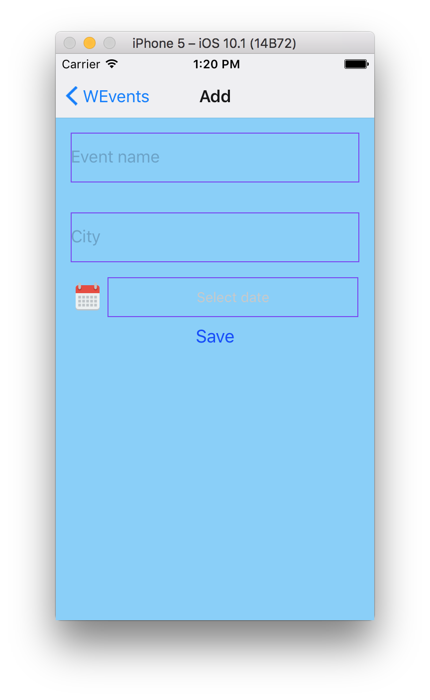
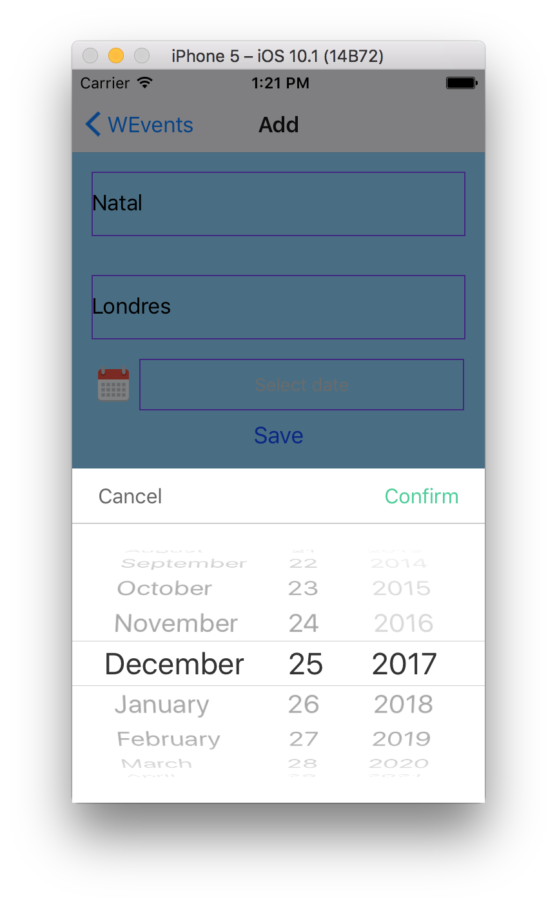
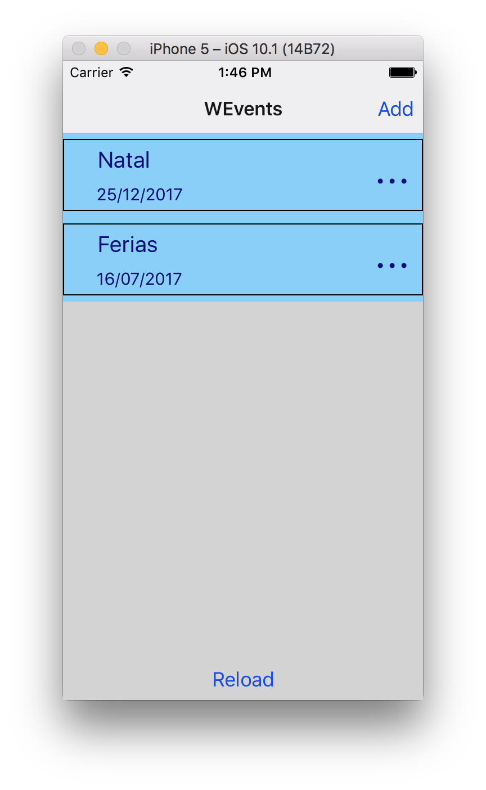
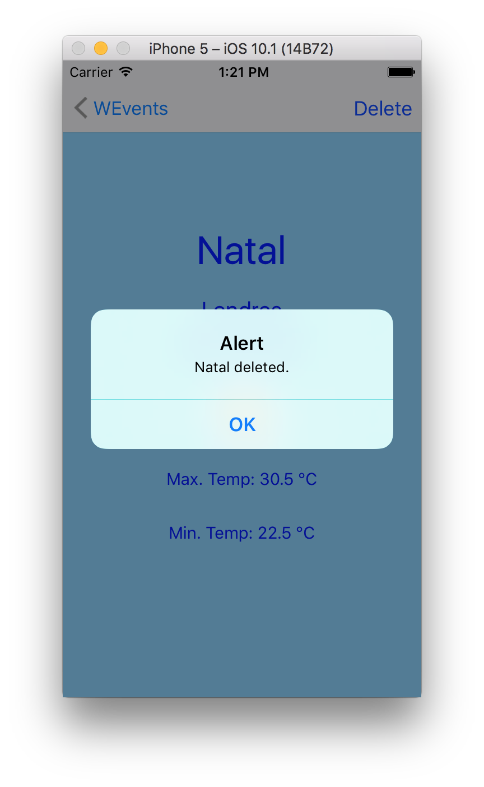

# weventsnative

Aplicativo WEvents:

Aplicativo onde é possível cadastrar seus eventos, selecionando um local e uma data, e o sistema faz a previsão das condições climáticas para esse dia.

APIs usadas:

- AsyncStorage para persistência.

- Componente DatePicker para seleção das datas. (https://github.com/xgfe/react-native-datepicker)

- React Navigation para navegação entre as telas.

- AccuWeather API para previsão do tempo.

Este aplicativo apenas um protótipo, devido as dificuldades encontradas abaixo:

- Reduzimos o escopo, pois inicialmente iria ser possível informar eventos com mais datas, e o app iria prever as condições climáticas de cada dia (datas apresentadas em uma segunda lista com os dias entre a data inicial e final). Porém levamos muito tempo para conseguir fazer o básico do app funcionar (em partes ao menos) como carregar valores do AsyncStorage no flat list, obter o resultado da API do clima, etc.

- Na tela inicial, foi criado um botão de "reload" para recarregar a flatlist após uma inserção/alteração/remoção de registro, pois não descobrimos como fazer mesmo após diversas pesquisas, e nem obtivemos resposta no slack da disciplina.

- A API gratuíta só permite a previsão do dia atual, ou dos próximos 5 dias. Como esse app é um protótipo, não consideramos a data do evento cadastrada, e sim suamos o método de prever 1 dia, para que sempre tenha uma previsão disponível.

- Testamos o layout no simulador do iOS. Ao compilar no device Android, o navigation fica completament fora do padrão, com botões normais na toolbar, sobrepondo a statusbar, os campos Text ficaram pequenos.

- Fizemos a consulta aninhada, uma com a resposta de outra, pois não entendemos como funciona a "promise". Tentamos encapsular as function em const, var, arrow functions, e nunca conseguimos usar o retorno do ".fetch" fora do ".then()", pois sempre é uma "promise". Tudo feito na base de tentativa e erro.

- Os testes não executavam mesmo em aula, por não termos usado o create react native app. Porém criando o app assim, o navigation não estava aparecendo. Na última aula, foi feito um questionamento a respeito, porém não obtivemos uma solução. Tentamos mais algumas vezes criar o app com o "CRNA", porém sempre com o mesmo prolema do navigation e, para não perder mais tempo ainda no trabalho, seguimos usando o nosso onde o navigation funcionava.

